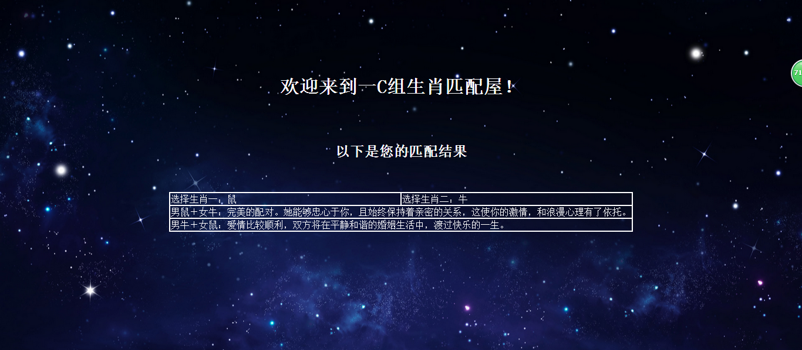

# Zodiac Match House
英文项目：Zodiac Match House，Zodiac的中文是十二宫位，在外国对应的是十二星座，而在中国则对应的是十二生肖。Match是匹配的意思， 因此本项目是用于查询中国的十二生肖男女匹配信息。
-------------------

		
## 简介： 
1. 通过生肖匹配平台，帮助用户查询匹配信息。
2. 输入方面用户可输入想要查询并获得匹配结果的两个生肖（如“虎”和“牛”）。
3. 输出方面则是查询的两个测试者的生肖是否配对及其评价信息，分别输出生肖男生肖女的交叉匹配资料，共144种匹配资料。
4. 数据来源为[DT阿凡达数据](http://avatardata.cn/Docs/Api/08803b8c-6ce0-4dd0-9809-361a06f25c99) 取得的的api数据库和手动添加的生肖类型的[tsv档](data/shengxiao_data.tsv)。
5. 选择范围为[十二生肖](data/shengxiao_data.tsv)，即可供选择以下生肖：
* 鼠
* 牛
* 虎
* 兔
* 龙
* 蛇
* 马
* 羊
* 猴
* 鸡
* 狗
* 猪

### 输入：
* 用户选择两个匹配者的生肖，交互界面使用到[HTML之select 表单元素](http://www.w3school.com.cn/tags/tag_select.asp)加[HTML5之datalist标签](http://www.w3school.com.cn/html5/html5_datalist.asp)，显示的是生肖，其对应值是对应显示的生肖。所以代码文件可以找到所需要的生肖，即用户可以通过填写生肖名或者选择生肖名输入所需要的指标。 
* 详情见[templates/C_entry.html](templates/C_entry.html)。
 

### 输出：
* 两个测试者的生肖。
* 两个生肖的男女交叉匹配资料：是否配对及相关评价信息。
* 从后台读取数据：使用HTML的{{...}}，读取{{...}}中的对象和变量，获得相关数据。
* 详情见[templates/C_results.html ](templates/C_results.html)。

## 从输入到输出，本组作品使用了：

### 数据
 由于API无匹配者的生肖资料档，所以手动生成生肖类型的[tsv档](data/shengxiao_data.tsv)，在文件中读入，并做成字典读出相对应的内容。

### 模块
* [json](http://www.json.org/json-zh.html) 
* [requests](http://cn.python-requests.org/zh_CN/latest/) 
* [urllib](https://baijiahao.baidu.com/po/feed/share?wfr=spider&for=pc&context=%7B"sourceFrom"%3A"bjh"%2C"nid"%3A"news_3437549851525350677"%7D) 
* [flask](http://www.liaoxuefeng.com/wiki/001374738125095c955c1e6d8bb493182103fac9270762a000/001386832805619b3e68a9cf16c4d0398d8af8f6d50e740000) 

### API
* 来源： [DT阿凡达数据](http://avatardata.cn/Docs/Api/08803b8c-6ce0-4dd0-9809-361a06f25c99)
* 从[DT阿凡达数据](http://avatardata.cn/Docs/Api/08803b8c-6ce0-4dd0-9809-361a06f25c99)平台中获取生肖配对的API接口和秘钥key及相关资料，然后在[Zodiac_run.py](Zodiac_run.py) 中抓取网站、调用API。

## Web APP动作描述：

* 以下是web请求前的准备工作：

1. 在网页[DT阿凡达数据](http://avatardata.cn/Docs/Api/08803b8c-6ce0-4dd0-9809-361a06f25c99)中，手动复制出所有的生肖匹配资料，保存成一个十二生肖的tsv档，保存到本地的data文件夹中。分别存在data文件夹中的[shengxiao_data.tsv](data/shengxiao_data.tsv)。

2. 在[shengxiao.py](shengxiao.py)定义两个类shengxiao1 ()和shengxiao2 (),读取[shengxiao_data.tsv](data/shengxiao_data.tsv)这个数据档，并分别把数据返回一个生肖匹配信息的字典，建立以中文名称的生肖为键，相对应的生肖匹配信息为值的字典self.find_shenxiao(见代码self.find_shenxiao = {d['shenxiao_from']:d['shenxiao_to'] for d in list_dict_shenxiao}。

3. 在[shengxiao.py](shengxiao.py)中导入一个读取data文件夹中生肖类型的类shengxiao_data.py使用自定义函数读取生肖类型的字典(见代码shenxiao_from_to)并把一个生肖类型的字典中的键提取出来，放入[templates/C_entry.html](templates/C_entry.html)中作为生肖匹配的选择列表(见代码r_list=[k for k in r.find_shenxiao.keys()]）。

* 以下按web 请求（web request） - web 响应 时序说明：

1. 後端伺服器启动：执行 [Zodiac_run.py](Zodiac_run.py) 启动後端伺服器，等待web 请求。启动成功应出现： * Running on http://127.0.0.1:5000/ (Press CTRL+C to quit)。

2. 前端浏览器web 请求：访问 http://127.0.0.1:5000/ 启动前端web 请求。

3. 後端伺服器web 响应：[Zodiac_run.py](Zodiac_run.py) 中 执行 了@app.route('/') 下的 entry_page()函数，以HTML模版[templates/C_entry.html](templates/C_entry.html)及一个含指标代码及名称的字典（见代码entry_shenxiao_list=r_list ）产出的产生《欢迎来到欢迎来到一C组生肖匹配屋！》的HTML页面。

4. 前端浏览器收到web 响应：出现HTML页面有HTML表单的输入 select表单元素 变数名称(name) 为"text"，变数名称(name)为'shengxiao1'，'shengxiao2'使用了HTML的select表单元素,详见HTML模版[templates/C_entry.html](templates/C_entry.html)。

5. 前端浏览器web 请求：用户选取指标後按了提交钮「开始匹配！」，则产生新的web 请求，按照form元素中定义的method='POST' action='/search4'，以POST为方法，动作为/search4'的web 请求。

6. 後端服务器收到用户web 请求，匹配到@app.route('/search4', methods=['POST'])的函数 do_search()。

7. [Zodiac_run.py](Zodiac_run.py) 中 def do_search() 函数，把用户提交的数据，以flask 模块request.form['shengxiao1'],['shengxiao2']	取到Web 请求中，HTML表单变数名称shengxiao1,shengxiao2的值，存放在shengxiao_1,shengxiao_2这Python变数下，再使用flask模块render_template 函数以templates/results.html模版为基础（输出），其中模版中results_001,results_002,results_003,results_004的值，用the_shengxiao1,the_shengxiao2,the_content1,the_content2这变数之值，其他4项值如此类推。

8. 前端浏览器收到web 响应：模版中[templates/C_results.html ](templates/C_results.html) 的变数值正确的产生的话，前端浏览器会收到正确响应，看到指标的相关元数据。

### 作者成员：
见[_team_.tsv](_team_/_team_.tsv)
* Gwenshiga
* CherryLichan
* HuangJiaLi
* q3466141541
* JiawenLai
* ChanJuanLai

